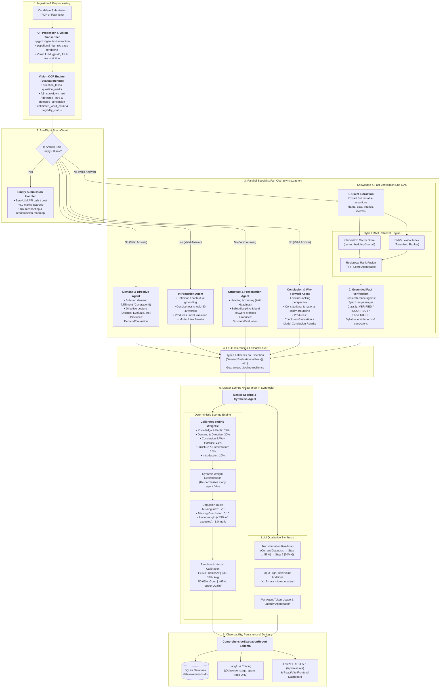

# Autonomous UPSC Mains Answer Evaluation & Feedback Engine

An autonomous, multi-agent evaluation engine designed to assess UPSC Mains handwritten and digital answer copies, verify facts against grounded syllabus knowledge via Hybrid RAG, and deliver calibrated scores with actionable transformation roadmaps.

The system executes a **Deterministic Native DAG (Directed Acyclic Graph)** using an **Ensemble / "Panel of Judges" Architecture**. Five isolated specialist agents evaluate specific dimensions (Demand, Introduction, Structure, Conclusion, and RAG-grounded Facts) concurrently via asynchronous fan-out before a Master Scoring Arbiter synthesizes the final calibrated assessment.

---

## Exact Agent DAG Architecture

The evaluation pipeline operates as a deterministic, asynchronous state machine orchestrated by [`EvaluationOrchestrator`](file:///Users/vishalsinha/Documents/answer%20writing%20evaluation/src/evaluator/orchestrator.py):



---

## Detailed Agent Breakdown

| Node / Agent | Module File | Input Data | Core Responsibility & Criteria | Rubric Weight | Key Output Artifacts |
| :--- | :--- | :--- | :--- | :--- | :--- |
| **Vision OCR Engine** | [`pdf_processor.py`](file:///Users/vishalsinha/Documents/answer%20writing%20evaluation/src/evaluator/pdf_processor.py) | Uploaded PDF bytes / scanned pages | • Extracts digital text via `pypdf`<br/>• Renders pages via `pypdfium2`<br/>• Transcribes handwriting using Vision LLM (`gpt-4o`) if digital text < 40 words<br/>• Heuristically segments question, intro, and conclusion | Pre-processing | Vision OCR Engine payload ([`EvaluationInput`](file:///Users/vishalsinha/Documents/answer%20writing%20evaluation/src/evaluator/schemas.py)) |
| **1. Demand & Directive Agent** | [`demand_agent.py`](file:///Users/vishalsinha/Documents/answer%20writing%20evaluation/src/evaluator/agents/demand_agent.py) | `question_text`, `full_markdown_text`, `question_marks` | • Identifies explicit and implicit sub-demands<br/>• Evaluates directive posture (`Critically Examine`, `Discuss`, `Evaluate`, `Elucidate`)<br/>• Checks core vs peripheral focus | **30%** | `directive_adherence_score` (0-10), `demand_coverage_pct`, list of unaddressed sub-parts, itemized critique |
| **2. Introduction Agent** | [`intro_agent.py`](file:///Users/vishalsinha/Documents/answer%20writing%20evaluation/src/evaluator/agents/intro_agent.py) | `question_text`, `detected_intro`, `question_marks` | • Validates introduction presence<br/>• Assesses conciseness (target: 30-40 words)<br/>• Checks contextual definition, origin, or contemporary background | **10%** | `intro_present` (bool), `intro_score` (0-10), `conciseness_score`, `contextual_score`, plug-and-play `model_intro_rewrite` |
| **3. Structure & Presentation Agent** | [`structure_agent.py`](file:///Users/vishalsinha/Documents/answer%20writing%20evaluation/src/evaluator/agents/structure_agent.py) | `question_text`, `full_markdown_text` | • Audits heading taxonomy (`### Headings` matching question keywords)<br/>• Enforces bullet formatting discipline and bold keyword prefixes<br/>• Evaluates logical flow and readability transitions | **10%** | `structural_score` (0-10), `heading_taxonomy_score`, `bullet_discipline_score`, concrete formatting upgrades |
| **4. Conclusion & Way Forward Agent** | [`conclusion_agent.py`](file:///Users/vishalsinha/Documents/answer%20writing%20evaluation/src/evaluator/agents/conclusion_agent.py) | `question_text`, `detected_conclusion`, `question_marks` | • Validates conclusion presence<br/>• Assesses forward-looking balance (Way Forward / solutions)<br/>• Bridges topic to constitutional values, SDGs, or national vision | **15%** | `conclusion_present` (bool), `conclusion_score` (0-10), `forward_looking_score`, `balance_score`, plug-and-play `model_conclusion_rewrite` |
| **5. Knowledge & Fact Agent** | [`fact_agent.py`](file:///Users/vishalsinha/Documents/answer%20writing%20evaluation/src/evaluator/agents/fact_agent.py) | `question_text`, `full_markdown_text`, Hybrid RAG | **Sub-DAG:**<br/>1. Extracts 3-6 testable factual claims (dates, acts, articles, treaties)<br/>2. Retrieves authentic passages via Hybrid RAG (ChromaDB dense vectors + BM25 sparse lexical search + RRF fusion)<br/>3. Verifies each claim (`VERIFIED`, `INCORRECT`, `UNVERIFIED`) and provides textbook corrections | **35%** | `factual_accuracy_score` (0-10), itemized `claims_checked` with corrections and citations, `syllabus_enrichments` |
| **6. Master Scoring Arbiter** | [`master_arbiter.py`](file:///Users/vishalsinha/Documents/answer%20writing%20evaluation/src/evaluator/agents/master_arbiter.py) | Outputs of all 5 specialists + Vision OCR Engine payload | • Deterministic mathematical score aggregation with dynamic re-weighting upon partial failures<br/>• Applies penalties (missing intro/conclusion, severe under-length)<br/>• Calibrates score against real-world UPSC benchmarks<br/>• Synthesizes unified Transformation Roadmap and Top 3 Value Additions<br/>• Consolidates token usage telemetry | Arbiter / Fan-In | [`ComprehensiveEvaluationReport`](file:///Users/vishalsinha/Documents/answer%20writing%20evaluation/src/evaluator/schemas.py), [`ConsolidatedScorecard`](file:///Users/vishalsinha/Documents/answer%20writing%20evaluation/src/evaluator/schemas.py), [`TransformationRoadmap`](file:///Users/vishalsinha/Documents/answer%20writing%20evaluation/src/evaluator/schemas.py) |

---

## Scoring Formula & Calibration Rules

### 1. Deterministic Weight Distribution
The Master Arbiter computes the candidate's composite score using an objective mathematical formula rather than freeform LLM estimation:

$$\text{Raw Weighted Score (out of 10)} = 0.35 \times S_{\text{fact}} + 0.30 \times S_{\text{demand}} + 0.15 \times S_{\text{conclusion}} + 0.10 \times S_{\text{structure}} + 0.10 \times S_{\text{intro}}$$

$$\text{Scaled Score} = \left(\frac{\text{Raw Weighted Score}}{10.0}\right) \times \text{Question Marks}$$

### 2. Dynamic Weight Redistribution
If any specialist agent encounters a failure or timeout, the orchestrator catches it via typed fallback objects, and the Master Arbiter dynamically excludes that dimension and re-normalizes the remaining active weights so they strictly sum to 1.0 (100%), preventing systemic score collapse.

### 3. Objective Penalties
- **Missing Introduction:** Automatically awards `0.0 / 10` for the opening dimension.
- **Missing Conclusion:** Automatically awards `0.0 / 10` for the Way Forward dimension.
- **Severe Under-Length Deduction:** If the word count is less than 45% of the expected length (150 words for 10M, 250 words for 15M), an automatic `-1.0 mark` deduction is applied.

### 4. Benchmark Verdict Calibration
Scores are mapped directly to calibrated UPSC percentile tiers:
- **< 35.0%:** *Below Average / Needs Fundamental Revision*
- **35.0% – 49.9%:** *Average / Baseline Attempt*
- **50.0% – 64.9%:** *Good / Competitive Mains Standard*
- **$\ge$ 65.0%:** *Topper Quality / Exceptional Answer*

---

## Implementation Roadmap & Status

```
[Milestone 1: Multi-Agent Core Engine & GS-1 Pilot]  [COMPLETED]
  ├── Step 1: Standardized Pydantic Schemas & Shared Evaluation State
  ├── Step 2: Demand & Directive Evaluator Agent
  ├── Step 3: Introduction Evaluator Agent & Model Rewrites
  ├── Step 4: Structure & Heading Taxonomy Evaluator Agent
  ├── Step 5: Conclusion & Way Forward Evaluator Agent
  ├── Step 6: Knowledge & Fact Agent with Hybrid RAG (ChromaDB + BM25 + RRF)
  ├── Step 7: Master Scoring Arbiter & Qualitative Transformation Roadmap
  └── Step 8: Asynchronous Orchestrator DAG with Fault-Tolerant Fan-Out / Fan-In
                │
                ▼
[Milestone 2: Infrastructure, UI & Generalization]    [IN PROGRESS]
  ├── [x] Vision-based Handwritten Answer OCR Pipeline (pypdfium2 + Vision LLM)
  ├── [x] Langfuse Observability Integration (@observe_stage, latency & token telemetry)
  ├── [x] SQLite Evaluation Persistence (data/evaluations.db)
  ├── [x] FastAPI REST Server (/api/evaluate, /api/history, /api/health)
  ├── [x] Interactive Frontend (React + Vite + Tailwind + Radix UI)
  ├── [ ] Domain Knowledge Expansion to GS-2, GS-3, and GS-4
  └── [ ] Visual Coordinate Margin Annotations on Original Handwritten PDFs
```
