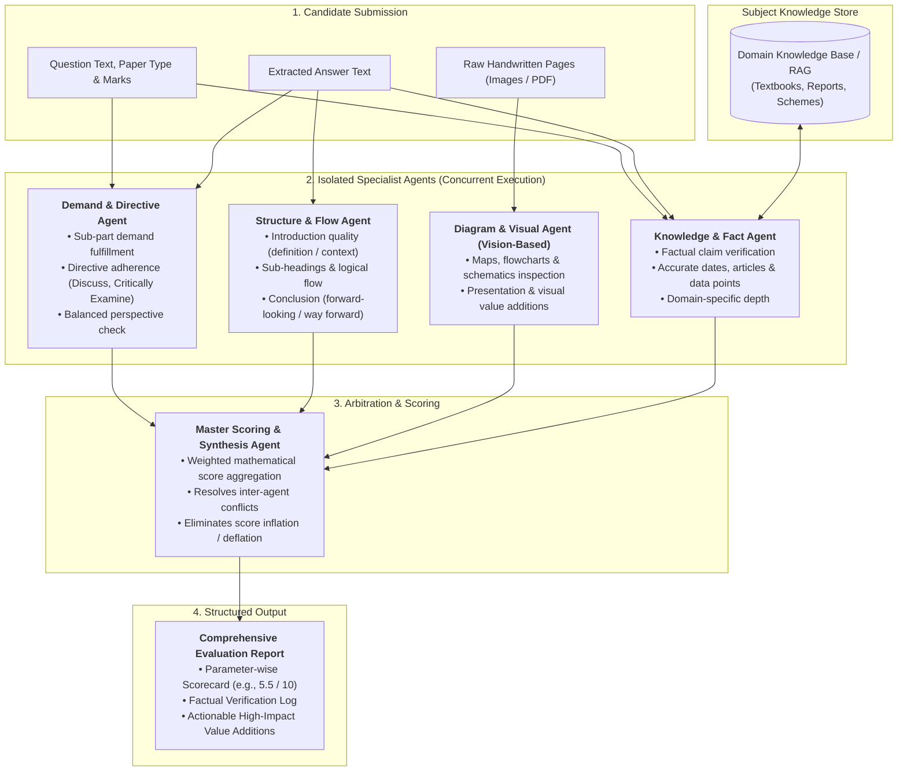

# Autonomous UPSC Mains Answer Evaluation & Feedback Engine

An autonomous, multi-agent evaluation engine designed to assess UPSC Mains handwritten answer copies, verify facts against grounded knowledge, and deliver calibrated scores with actionable feedback.

The system uses an **Ensemble / "Panel of Judges" Architecture**, where isolated specialist agents evaluate specific dimensions (Demand, Structure, Diagrams, and RAG-grounded Facts) concurrently before a Master Scoring Agent synthesizes the final assessment.

---

## System Architecture



---

## Specialist Agent Breakdown

| Agent | Input Type | Isolated Responsibility | Output Produced |
| :--- | :--- | :--- | :--- |
| **1. Demand & Directive Agent** | Text | Validates whether all sub-parts of the question were answered and whether the analytical posture matches the directive (`Critically Examine`, `Evaluate`, `Elucidate`). | Demand coverage %, unaddressed sub-parts, directive adherence score. |
| **2. Structure & Flow Agent** | Text | Evaluates structural discipline: contextual introduction, clear heading taxonomy, bullet points, smooth transitions, and a forward-looking conclusion. | Structural score, organization breakdown, flow critique. |
| **3. Diagram & Visual Agent** | Vision (Image) | Directly inspects handwritten pages to evaluate pencil/pen diagrams, geography maps, flowcharts, and spatial presentation. | Diagram detection, visual relevance score, missing visual opportunities. |
| **4. Knowledge & Fact Agent** | Text + RAG | Extracts factual claims, dates, constitutional articles, and data points, verifying them against the reference knowledge store. | Fact-check verification report, factual errors, missing core domain points. |
| **5. Master Scoring Agent** | Agent Reports | Applies a weighted scoring formula across all specialist evaluations, calibrates the final score, and synthesizes unified actionable advice. | Final calibrated marks, strengths, critical gaps, and high-impact value additions. |

---

## Sequential Implementation Roadmap

We develop the system step-by-step, beginning with a **GS-1 pilot (History, Geography, Society)**.

```
[Milestone 1: Multi-Agent Core Engine & GS-1 Pilot]
  ├── Step 1: Agent Schemas & Shared Evaluation State
  ├── Step 2: Demand & Directive Evaluator Agent
  ├── Step 3: Structure & Presentation Evaluator Agent
  ├── Step 4: Diagram & Visual Agent (Vision LLM)
  ├── Step 5: Knowledge & Fact Agent with RAG Store
  ├── Step 6: Master Scoring & Synthesis Agent
  └── Step 7: End-to-End Orchestrator & Benchmark Testing
                │
                ▼
[Milestone 2: Generalization & Advanced Features]
  ├── Step 8: Domain Knowledge Expansion (GS-2, GS-3, GS-4)
  ├── Step 9: Visual Coordinate Annotations on Handwritten PDFs
  ├── Step 10: Tracing, Observability & Deployment
```

---

### Milestone 1: Multi-Agent Core Engine (Piloting on GS-1)
*Goal: Build an end-to-end, multi-agent evaluation pipeline using GS-1 as our first baseline.*

#### Step 1: Agent Schemas & Shared Evaluation State
- [ ] Define standardized Pydantic data schemas for:
  - Input: Question, marks, candidate text, and raw page images.
  - Agent Outputs: Individual scorecards, flags, and itemized feedback from each specialist agent.
  - Final Output: Consolidated evaluation report and rubric breakdown.

#### Step 2: Demand & Directive Evaluator Agent
- [ ] Build the isolated prompt and logic to:
  - Deconstruct question into sub-demands.
  - Enforce directive rules (`Discuss` vs `Critically Analyze` vs `Examine`).
  - Score question demand fulfillment.

#### Step 3: Structure & Flow Evaluator Agent
- [ ] Build the isolated prompt and logic to:
  - Analyze introduction quality (context/definition).
  - Inspect body structuring (use of subheadings, bullet points, paragraph balance).
  - Assess conclusion (balance, forward-looking perspective).

#### Step 4: Diagram & Visual Agent (Multimodal Vision)
- [ ] Build the vision-based inspection pipeline:
  - Process handwritten answer page images directly via Vision LLM.
  - Detect maps, flowcharts, tables, and diagrams.
  - Evaluate visual quality and recommend spatial/diagram additions.

#### Step 5: Knowledge & Fact Agent with RAG Store
- [ ] Build knowledge grounding pipeline:
  - Extract entities, dates, and claims from the candidate's answer.
  - Set up a lightweight RAG store (curated GS-1 reference texts/facts).
  - Ground factual accuracy and flag errors or unverified statements.

#### Step 6: Master Scoring & Synthesis Agent
- [ ] Build the aggregation arbiter:
  - Apply weighted scoring rubric across all specialist outputs.
  - Calibrate marks to real-world UPSC standards (avoid score inflation).
  - Synthesize a coherent, non-redundant feedback report.

#### Step 7: End-to-End Orchestrator & Testing
- [ ] Connect agents into an asynchronous state machine (running specialists in parallel).
- [ ] Test against sample GS-1 answers to verify accuracy, latency, and feedback quality.

---

### Milestone 2: Generalization & Advanced Capabilities
*Goal: Expand domain depth across all General Studies papers and build production UI overlays.*

#### Step 8: Domain Expansion to GS-2, GS-3, and GS-4
- [ ] **GS-2 Knowledge Store:** Articles, Supreme Court precedents, Law Commission / 2nd ARC reports.
- [ ] **GS-3 Knowledge Store:** Budget/Economic Survey data, schemes, NITI Aayog indices, environment treaties.
- [ ] **GS-4 Ethics Module:** Thinkers, ethical frameworks, case-study stakeholder matrix.

#### Step 9: Visual Margin Annotations
- [ ] Project agent findings onto pixel coordinates of original answer sheets.
- [ ] Output an annotated PDF with color-coded margin notes (red for factual errors, green for strong points, blue for structure).

#### Step 10: Tracing, Observability & Deployment
- [ ] Trace latency and cost per agent.
- [ ] Package orchestrator into a clean API / CLI for easy integration.
