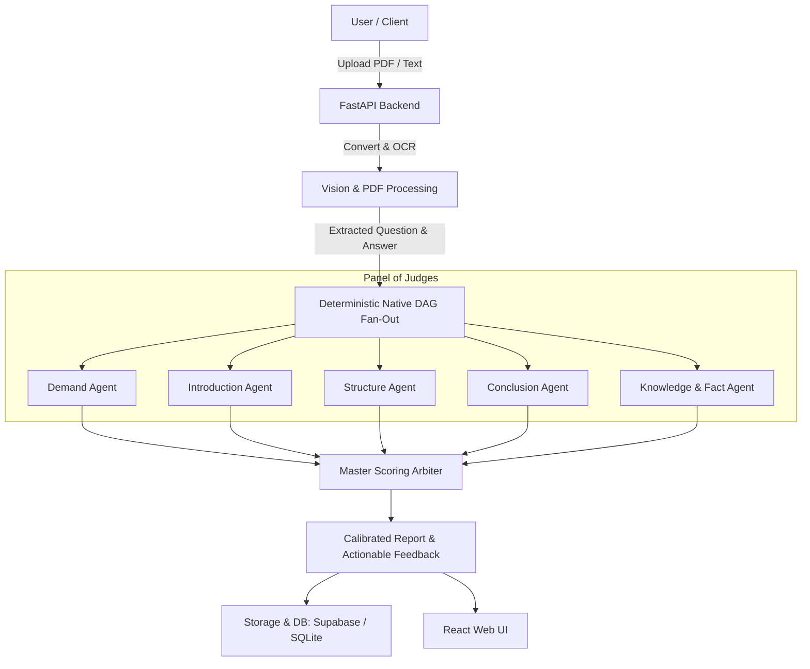

# Autonomous UPSC Mains Answer Evaluation & Feedback Engine

An autonomous, multi-agent evaluation engine designed to assess UPSC Mains handwritten and digital answer copies, verify facts against authoritative syllabus benchmarks via LLM, and deliver calibrated scores with actionable transformation roadmaps.

The system executes a **Deterministic Native DAG (Directed Acyclic Graph)** using an **Ensemble / "Panel of Judges" Architecture**. Five isolated specialist agents evaluate specific dimensions (Demand, Introduction, Structure, Conclusion, and Knowledge & Facts) concurrently via asynchronous fan-out before a Master Scoring Arbiter synthesizes the final calibrated assessment.

---

## 🏗 System Architecture



---

## 🚀 Deployment Guide

The platform is split into a **FastAPI backend** (containerized on Render) and a **React + Vite frontend** (hosted on Vercel).

### 1. Backend Deployment (Render)

The backend is deployed as a **Docker Web Service** on Render to ensure system-level dependencies (such as `poppler-utils` for PDF rendering) are available.

#### Setup Steps:
1. **Create a New Web Service** on [Render](https://render.com).
2. Connect your Git repository.
3. Configure the service settings:
   - **Environment**: `Docker`
   - **Dockerfile Path**: `./Dockerfile`
   - **Docker Context**: `.`
   - **Health Check Path**: `/api/health`
4. **Environment Variables**:
   Add the following variables in the Render Dashboard (**Environment** tab):

| Variable | Description | Example / Default |
| :--- | :--- | :--- |
| `OPENAI_API_KEY` | OpenAI API key for LLM agents & embeddings | `sk-proj-...` |
| `OPENAI_MODEL` | Default model for evaluation agents | `gpt-4o` |
| `DATABASE_BACKEND` | Database persistence (`supabase` or `sqlite`) | `supabase` |
| `SUPABASE_URL` | Supabase project URL | `https://your-project.supabase.co` |
| `SUPABASE_ANON_KEY` | Supabase anonymous API key | `eyJh...` |
| `SUPABASE_STORAGE_BUCKET`| Supabase bucket name for uploaded answer PDFs | `evaluations` |
| `LANGFUSE_PUBLIC_KEY` | *(Optional)* Langfuse public key | `pk-lf-...` |
| `LANGFUSE_SECRET_KEY` | *(Optional)* Langfuse secret key | `sk-lf-...` |
| `LANGFUSE_HOST` | *(Optional)* Langfuse host URL | `https://cloud.langfuse.com` |

> [!NOTE]
> Render automatically injects the dynamic `$PORT` environment variable. The `Dockerfile` binds Uvicorn to `0.0.0.0:${PORT:-8000}`.

---

### 2. Frontend Deployment (Vercel)

The frontend is a single-page React application built with Vite, deployed seamlessly on [Vercel](https://vercel.com).

#### Setup Steps:
1. **Import Project** on Vercel from your GitHub/GitLab account.
2. Configure project build settings:
   - **Framework Preset**: `Vite`
   - **Root Directory**: `frontend`
   - **Build Command**: `npm run build`
   - **Output Directory**: `dist`
   - **Install Command**: `npm install`
3. **Environment Variables**:
   Set the backend API connection URL:

| Variable | Description | Example |
| :--- | :--- | :--- |
| `VITE_API_BASE_URL` | Base URL of your deployed Render backend | `https://answer-writing-evaluation.onrender.com` |

4. Click **Deploy**. Vercel will build and assign an automated production URL (e.g., `https://answer-writing-evaluation.vercel.app`).

---

## 💻 Local Development

### Prerequisites
- Python 3.11+
- Node.js 18+ & npm
- `poppler` (for PDF processing):
  - macOS: `brew install poppler`
  - Ubuntu/Debian: `sudo apt-get install -y poppler-utils`

### 1. Backend Setup
```bash
# Create virtual environment and install dependencies
python3 -m venv .venv
source .venv/bin/activate
pip install -r requirements.txt

# Configure environment variables
cp .env.example .env
# Edit .env with your OpenAI and Supabase credentials

# Start FastAPI server
python -m src.api.server
# Server will run at http://127.0.0.1:8000 (Swagger docs at /docs)
```

### 2. Frontend Setup
```bash
cd frontend

# Configure environment variables
cp .env.example .env
# Set VITE_API_BASE_URL=http://127.0.0.1:8000 for local testing

# Install dependencies and start Vite dev server
npm install
npm run dev
# Frontend will run at http://127.0.0.1:5173
```

### 3. Run Both Concurrently
You can also launch both services concurrently using the helper script:
```bash
chmod +x run_dev.sh
./run_dev.sh
```

---

## 📁 Repository Structure

```
├── Dockerfile                  # Production container definition for Render
├── README.md                   # Project documentation
├── requirements.txt            # Python backend dependencies
├── run_dev.sh                  # One-click local development script
├── frontend/                   # React + Vite Frontend application
│   ├── src/                    # React components and styling
│   ├── package.json            # Frontend dependencies & scripts
│   └── vite.config.js          # Vite build config
├── src/                        # Evaluation Engine Backend
│   ├── api/                    # FastAPI endpoints & server
│   ├── evaluator/              # Multi-agent DAG orchestrator & agents
│   │   ├── agents/             # Specialist judge agents & Master Arbiter
│   │   ├── orchestrator.py     # Deterministic DAG execution engine
│   │   ├── pdf_processor.py    # PDF to image conversion & OCR extraction
│   │   └── schemas.py          # Pydantic data schemas
│   ├── db/                     # SQLite & Supabase repository layer
│   ├── services/               # Storage services (local / Supabase)
│   └── config.py               # Global settings & environment loader
└── tests/                      # Pytest evaluation suite
```

