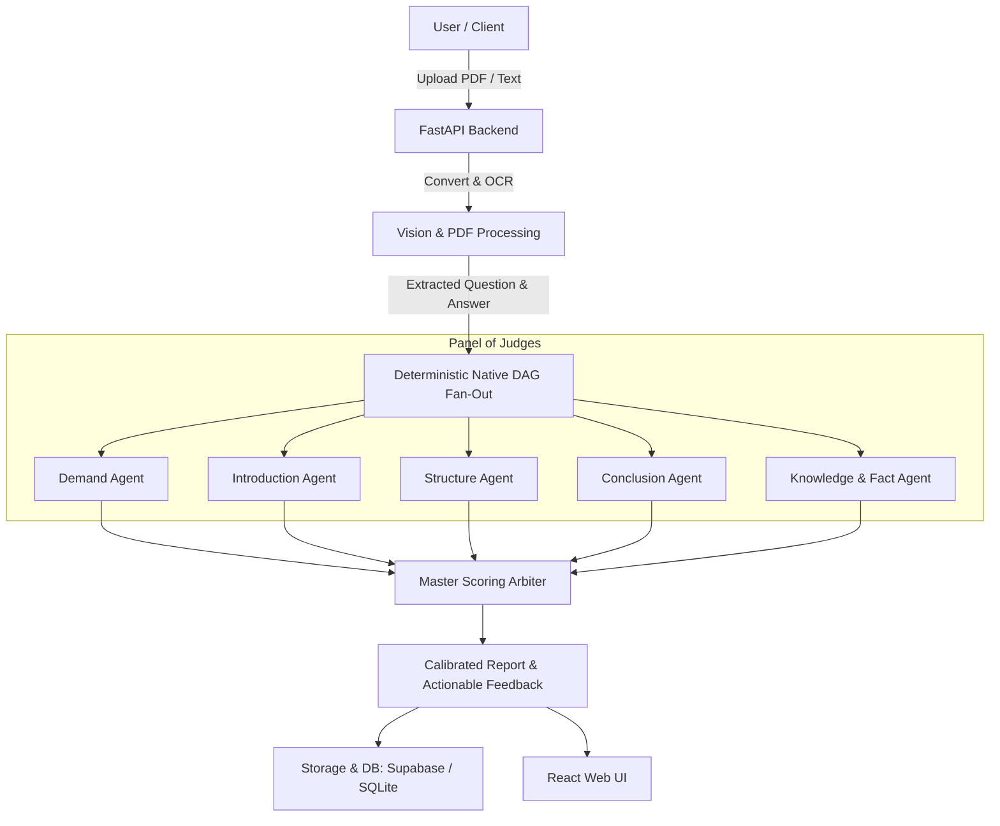

# Autonomous UPSC Mains Answer Evaluation & Feedback Engine

🔗 **Live Application**: [https://answer-writing-evaluation.vercel.app/](https://answer-writing-evaluation.vercel.app/)

An autonomous multi-agent engine to evaluate UPSC Mains handwritten and digital answers. It uses a parallel "Panel of Judges" architecture where five specialist agents evaluate key dimensions (Demand, Introduction, Structure, Conclusion, and Facts) before a Master Arbiter synthesizes the final calibrated score and feedback.

---

## 🏗 System Architecture



---

## 🚀 Deployment

The platform is deployed across:

- **Backend (Render)**: The FastAPI server is deployed as a Docker service on [Render](https://render.com) using the included [Dockerfile](./Dockerfile).
- **Frontend (Vercel)**: Live at [https://answer-writing-evaluation.vercel.app/](https://answer-writing-evaluation.vercel.app/) (deployed from `frontend/`, connecting to the Render backend via `VITE_API_BASE_URL`).
- **Database & Storage (Supabase)**: Evaluation records and PDF storage.

---

## 📊 Observability (Langfuse)

The evaluation pipeline includes built-in tracing and monitoring powered by [Langfuse](https://langfuse.com):
- **Multi-Agent Tracing**: Tracks prompts, model calls, latency, token usage, and outputs across all specialist judge agents and the Master Arbiter.
- **Pipeline Spans**: Traces end-to-end stages including PDF/OCR processing, parallel DAG execution, and database persistence.
- **Zero Overhead Setup**: Enabled automatically when `LANGFUSE_PUBLIC_KEY` and `LANGFUSE_SECRET_KEY` are configured in environment variables.


---

## 📌 TODO

- [ ] Evaluated Marks Normalization
- [ ] Comment rendering directly on pdf for better interaction
- [ ] Test batch processing via running on demand gpu powered machine every X hour for cost control.
- [ ] Support multi-page PDF batch processing with individual page-level annotations
- [ ] User authentication
- [ ] Historical performance trend tracking across attempts
- [ ] Support for open-source vision & reasoning models (e.g. PaddleOCR-VL, Qwen2.5-VL, DeepSeek-R1)
- [ ] Custom evaluation rubrics and subject-specific weightage customization (GS1 vs GS2/3/4)
- [ ] Custom knowledge base as a vector database to retrieve relevant information for the answer evaluation due to LLMs cut-off date.
- [ ] Real-time streaming evaluation updates via SSE
- [ ] Human in the loop verification
- [ ] Optimize pipeline to be cost efficient (cheaper models, context and prompt optimization, etc.)

---

## 💻 Local Development

### Prerequisites
- Python 3.11+
- Node.js 18+ & npm
- `poppler` (for PDF processing):
  - macOS: `brew install poppler`
  - Ubuntu/Debian: `sudo apt-get install -y poppler-utils`

### 1. Backend Setup
```bash
# Create virtual environment and install dependencies
python3 -m venv .venv
source .venv/bin/activate
pip install -r requirements.txt

# Configure environment variables
cp .env.example .env
# Edit .env with your OpenAI and Supabase credentials

# Start FastAPI server
python -m src.api.server
# Server will run at http://127.0.0.1:8000 (Swagger docs at /docs)
```

### 2. Frontend Setup
```bash
cd frontend

# Configure environment variables
cp .env.example .env
# Set VITE_API_BASE_URL=http://127.0.0.1:8000 for local testing

# Install dependencies and start Vite dev server
npm install
npm run dev
# Frontend will run at http://127.0.0.1:5173
```

### 3. Run Both Concurrently
You can also launch both services concurrently using the helper script:
```bash
chmod +x run_dev.sh
./run_dev.sh
```
